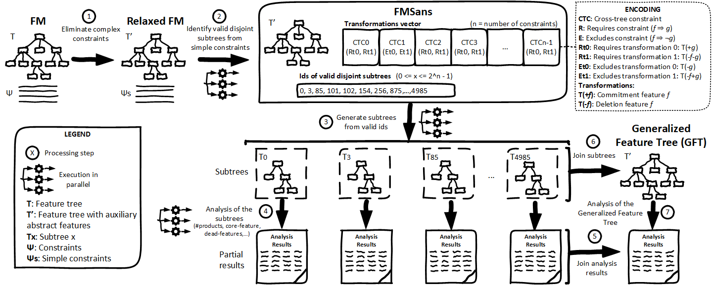

# Table of Contents
- [Table of Contents](#table-of-contents)
- [Bringing to fruition the complete elimination of cross-tree constraints to exploit the parallel analysis of feature models](#bringing-to-fruition-the-complete-elimination-of-cross-tree-constraints-to-exploit-the-parallel-analysis-of-feature-models)
  - [Artifact description](#artifact-description)
  - [How to use it](#how-to-use-it)
    - [Requirements](#requirements)
    - [Download and installation](#download-and-installation)
    - [Execution of the scripts](#execution-of-the-scripts)
    - [Additional scripts](#additional-scripts)
  
# Bringing to fruition the complete elimination of cross-tree constraints to exploit the parallel analysis of feature models
This repository contains all the resources and artifacts that support the paper entitled "Bringing to fruition the complete elimination of cross-tree constraints to exploit the parallel analysis of feature models" submmited to the 27th International Systems and Software Product Line Conference (SPLC 2023).

## Artifact description
We present an approach (illustrated in the figure below) to eliminating all cross-tree constraints from a feature model (FM) based on splitting the semantics of the FM into orthogonal subtrees with disjoint semantics. We propose the concept of *FMSans*, a new knowledge compilation technique for FMs encoding the cross-tree constraints and the disjoint subtrees that allows (1) analyzing the FM by exploiting parallel techniques, and (2) building a generalized feature tree (GFT) without constraints.

  

The artifact includes:
1. The Python scripts to perform the different steps of the approach. This includes the following scripts:
  - [step1.py](step1.py): Convert an FM in UVL (.uvl) to an FM in UVL (.uvl) with only simple constraints (requires and excludes). Complex constraints are refactored using the approach of [Knüppel et al.](https://doi.org/10.1145/3106237.3106252).
  - [step2.py](step2.py): Convert an FM in UVL (.uvl) with only simple constraints to an FMSans (.json). Simple constraints (requires and excludes) are refactored using the approach of [van den Broek et al.](https://citeseerx.ist.psu.edu/document?repid=rep1&type=pdf&doi=97c0f26a89db833e41113421c8c1e4633370cb82). 
    - [step2b_join.py](step2b_join.py): Join several .json files obtained when the script of the Step 2 is executed with several distributed tasks (see instructions below).
  - [step345.py](step345.py): Analyze an FMSans model (.json). It first builds the subtrees (step 3), analyzes them (step 4) and joins the analysis results (step 5).
  - [step36.py](step36.py): Generate a generalized feature tree (GFT) in UVL format (.uvl) from the FMSans model (.json). It first builds the subtrees (step 3), and then joins them to build the GFT (step 6).
  - [step7.py](step7.py): Analyze a generalized feature tree (GFT) in UVL format (.uvl).
  - [model_stats](model_stats.py): Show metrics (features, contraints, configurations, subtrees,...) of an FM. It supports FMs in UVL format, FMSans models in JSON format, and GFT in UVL format.

2. An implementation of the [*FMSans* concept and solver](fm_solver/). This includes:
  - The concepts of *feature tree*, *transformations vector*, and *ids of feature subtrees* included in FMSans.
  - Parallel versions of the analysis operations based on the hierarchical structure of the feature trees.
  - Model transformations to convert a feature model into a FMSans model, as well as readers/writers to serialize the models.

3. A [set of feature models](models/) in different versions used in our evaluation. This includes:
  - The original feature models (in UVL format).
  - The relaxed feature models with only simple constraints (in UVL format).
  - The FMSans models (in JSON format).
  - The generalized feature trees (in UVL format).

4. The [results of our evaluation](evaluation/) and [instructions to replicate the experiments](#execution-of-the-scripts).

## How to use it

### Requirements
Our approach has been implemented 100% in Python and is built on top of [Flama](https://flamapy.github.io/).
In particular, the main dependencies are:

- [Python 3.9+](https://www.python.org/)
- [Flama](https://flamapy.github.io/)

The framework has been tested in Linux (Mint and Ubuntu) and Windows 11.

### Download and installation
1. Install [Python 3.9+](https://www.python.org/)
2. Download/Clone this repository and enter into the main directory.
3. Create a virtual environment: `python -m venv env`
4. Activate the environment: 
   
   In Linux: `source env/bin/activate`

   In Windows: `.\env\Scripts\Activate`

   ** In case that you are running Ubuntu, please install the package python3-dev with the command `sudo apt update && sudo apt install python3-dev` and update wheel and setuptools with the command `pip  install --upgrade pip wheel setuptools` right after step 4.
   
5. Install the dependencies: `pip install -r requirements.txt`

### Execution of the scripts
Here we show how to execute our approach step by step with concrete examples using the JHipster FM.
You can use any other FM in the [models folder](models/) to replicate the results shown in the evaluation presented in the paper.
For each script, we describe its syntaxis, inputs, outputs, and an example of execution.

- **Step 1:** Convert an FM in UVL (.uvl) to an FM in UVL (.uvl) with only simple constraints (requires and excludes).
  
  - Execution: `python step1.py (-d DIR | -fm FEATURE_MODEL)`
  - Inputs: 
    - The `FEATURE_MODEL` parameter specifies the file path of the FM in UVL format.
    - Alternatively, the `DIR` parameter specifies a folder with a bunch of FMs in UVL format to convert all of them.
  - Outputs:
    - A FM file in UVL format with only simple constraints. The model is serialized in the same folder than the input FM with the sufix "_simple".
    - A .csv file named "step1_stats.csv" with information about the process for each model converted including the number of features, constraints, and execution time.
    - The standard output also details information about the process and the execution time.
  - Example: `python step1.py -fm models/fms/JHipster.uvl`

- **Step 2:** Convert an FM in UVL (.uvl) with only simple constraints to an FMSans (.json). If the input FM contains complex constraints, this step 2 will also execute the step 1 automatically.
  
  - Execution: `python step2.py (-fm FEATURE_MODEL | -d DIR) [-c N_CORES] [-t N_TASKS] [-i CURRENT_TASK]`
  - Inputs: 
    - The `FEATURE_MODEL` parameter specifies the file path of the FM in UVL format.
    - Alternatively, the `DIR` parameter specifies a folder with a bunch of FMs in UVL format to convert all of them.
    - The `N_CORES` parameter specifies the number of processes to be used. It is a priori optional taking as default value the number of cores in the computer. However, it must be specified if the number of cores is not power of 2.
    - The `N_TASKS` parameter is optional and specifies the number of tasks for distribution (default 1).
    - The `CURRENT_TASK` parameter is only required if `N_TASKS` is provided. `CURRENT_TASK` can be from 0 to `N_TASKS` - 1.
  - Outputs:
    - A FMSans file in .json format. The model is serialized in the same folder than the input FM with the sufix "_{N_CORES}_{CURRENT_TASK}-{N_TASKS}".
    - The standard output also details information about the process and the execution time.
  - Example: `python step2.py -fm models/simples/JHipster_simple.uvl -c 8`
  - Example with 2 distributed tasks:
    - `python step2.py -fm models/simples/JHipster_simple.uvl -c 8 -t 2 -i 0`
    - `python step2.py -fm models/simples/JHipster_simple.uvl -c 8 -t 2 -i 1`
    
    In case of using more than one task, the results is a set of .json files representing the FMSans. All these .json files can be joined into only one using the following script:
    - `python step2b_join.py dir` 
      - `dir` is the directory that contains only those .json to be joined. Please note that the directory can ONLY contains the .json files to be joined.

- **Steps 3, 4, and 5:** Analyze an FMSans model (.json). It first builds the subtrees (step 3), analyzes them (step 4) and joins the analysis results (step 5).
  
  - Execution: `python steps345.py (-d DIR | -fm FEATURE_MODEL) [-c N_CORES] [-r RUNS]`
  - Inputs: 
    - The `FEATURE_MODEL` parameter specifies the file path of the FMSans model in JSON format.
    - Alternatively, the `DIR` parameter specifies a folder with a bunch of FMSans model in JSON format to analyze all of them.
    - The `N_CORES` parameter specifies the number of processes to be used. It is a priori optional taking as default value the number of cores in the computer. However, it must be specified if the number of cores is not power of 2.
    - The `RUNS` parameters specifies the number of executions to be performed.
  - Outputs:
    - A .csv file named "steps345_stats_{N_CORES}cores.csv" with information about the analysis for each model analyzed and run executed including statistical information about execution times and memory consumption.
    - The standard output also details information about the process, the execution time and memory consumption.
  - Example: `python steps345.py -fm models/jsons/JHipster.json -c 8`

- **Steps 3 and 6:** Generate a generalized feature tree (GFT) in UVL format (.uvl) from the FMSans model (.json). It first builds the subtrees (step 3), and then joins them to build the GFT (step 6).
  
  - Execution: `python steps36.py -fm FEATURE_MODEL [-c N_CORES]`
  - Inputs: 
    - The `FEATURE_MODEL` parameter specifies the file path of the FMSans model in JSON format.
    - The `N_CORES` parameter specifies the number of processes to be used. It is a priori optional taking as default value the number of cores in the computer. However, it must be specified if the number of cores is not power of 2.
    *Note:* there is not `DIR` parameter in these steps because these steps are too hard computationally (in time and memory) and it does not make sense to do it for a bunch of models.
  - Outputs:
    - A GFT model in UVL format (.uvl). The UVL model is serialized in the same folder than the input FMSans with the sufix "_gft". This model can contain multiple ocurrences of features in the feature tree. 
    - The standard output also details information about the process and the execution time.
  - Example: `python steps36.py -fm models/jsons/JHipster.json -c 8`

- **Step 7:** Analyze a generalized feature tree (GFT) in UVL format (.uvl).
  
  - Execution: `python steps36.py (-d DIR | -fm FEATURE_MODEL) [-r RUNS]`
  - Inputs: 
    - The `FEATURE_MODEL` parameter specifies the file path of the GFT model in UVL format.
    - Alternatively, the `DIR` parameter specifies a folder with a bunch of GFT models in UVL format to analyze all of them.
    - The `RUNS` parameters specifies the number of executions to be performed.
  - Outputs:
    - A .csv file named "step7_stats.csv" with information about the analysis for each model analyzed and run executed including statistical information about execution times and memory consumption.
    - The standard output also details information about the process, the execution time and memory consumption.
  - Example: `python step7.py -fm models/gfts/JHipster_gft.uvl`

### Additional scripts
We provide the following scripts that allows performing other related stuff in our approach.

- **Models' metrics:** Show metrics (features, contraints, configurations, subtrees,...) of a model regardless its format. It supports FMs in UVL format, FMSans models in JSON format, and GFT in UVL format.
  
  - Execution: `python model_stats.py (-d DIR | -fm FEATURE_MODEL) [-c N_CORES]`
  - Inputs: 
    - The `FEATURE_MODEL` parameter specifies the file path of the FM in .uvl format or the FMSans in JSON format.
    - Alternatively, the `DIR` parameter specifies a folder with a bunch of models to analyze all of them.
    - The `N_CORES` parameter specifies the number of processes to be used and it is only applicable to FMSans models. It is a priori optional taking as default value the number of cores in the computer. However, it must be specified if the number of cores is not power of 2. 
  - Outputs:
    - A .csv file named "models_stats.csv" with information about the analysis for each model analyzed.
    - The standard output also details information about the process and shows the same information present in the .csv file.
  - Example for FM in UVL: `python model_stats.py -fm models/fms/JHipster.uvl`
  - Example for FMSans in JSON: `python model_stats.py -fm models/jsons/JHipster.json`
  - Example for GFT in UVL: `python model_stats.py -fm models/gfts/JHipster_gft.uvl`

